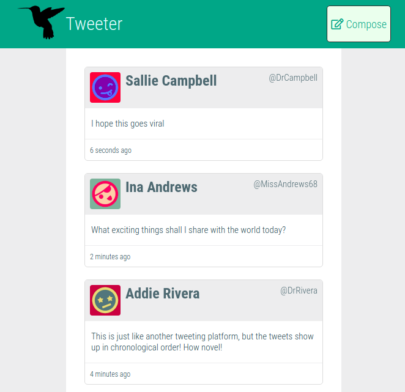
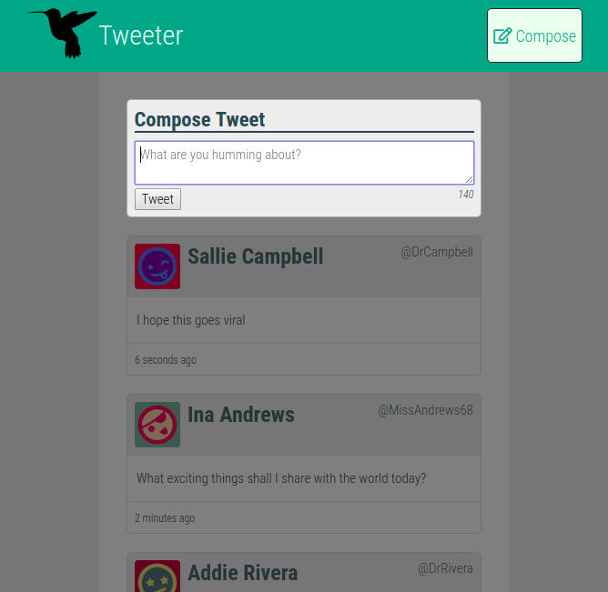

# Tweeter Project

Tweeter is a simple, single-page Twitter clone.

This project was started as a project for Lighthouse Labs Web Development bootcamp, as a means of practicing full-stack development using HTML, CSS, JS, jQuery and AJAX for the front-end, and Node, Express and MongoDB for the back-end.

# Screenshots

## Getting Started

1. Fork this repository, then clone your fork of this repository.
2. Install dependencies using the `npm install` command.
3. Start the web server using the `npm run local` command. The app will be served at <http://localhost:8080/>.
4. Go to <http://localhost:8080/> in your browser.

## Dependencies

- Express
- Node 5.10.x or above
- MongoDB
